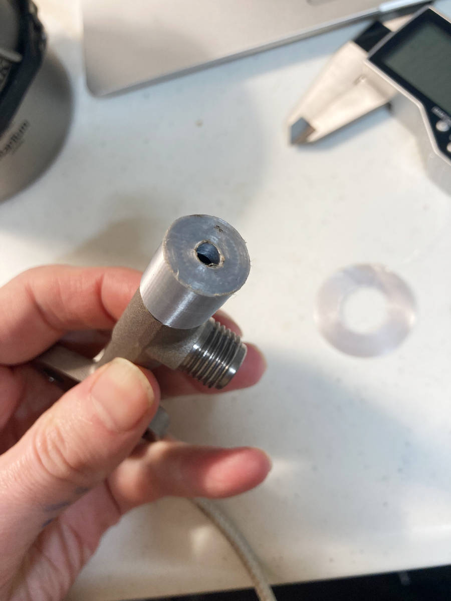

# Drill bit guide to help remachine inner face of Gaggia Classic/Pro steam valve

I designed and 3D printed a housing that fits over the end of the steam valve with a hole for a drill bit. Modify the variables in the OpenSCAD file to match your drill bit size (e.g. 5mm).

See [this video](https://www.youtube.com/watch?v=df1XOGSmStI) by Peter from Brew Better for instructions on fixing the leaking steam valve. Where he says to use a 5mm end mill, you can try printing this part instead to keep a drill bit stable and level. No guarantees!

Variables to modify:
* *roof* (4mm by default) - how high the housing extends above the end of the steam valve. Increasing this should improve the stability of the drill; at 4mm, I could wiggle the drill bit, but thought stability was OK.
* *diameter* (11.98mm) - the diameter as measured at the steam valve end base. Could increase for an easier fit.
* *bitDiameter* (4.7mm) - the size of the drill bit hole. This was just the closest to 5mm size I found in my toolbox.

Printing:
+ When slicing in Cura, click the part, choose 'Rotate', 'Select face to align to build plate', and click the flat face around the drill hole. This flips the part upside down and lets you print with no supports.
